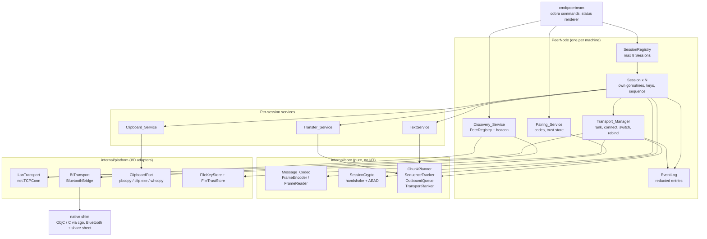
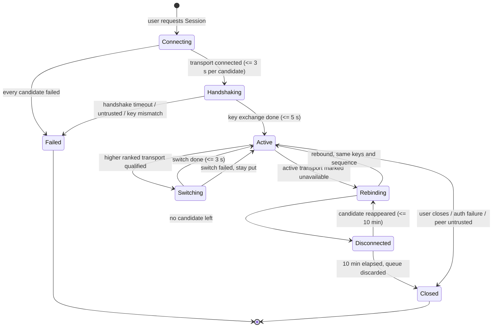
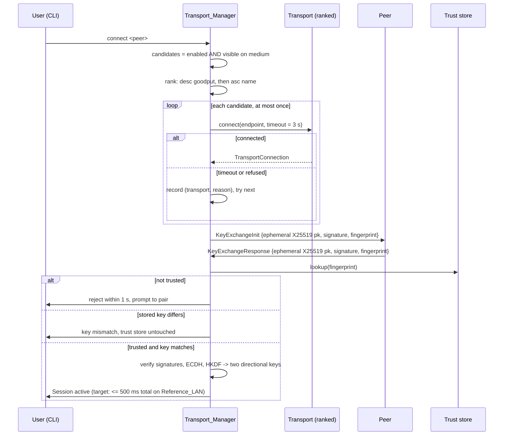

# Design Document

## Overview

Peerbeam is a single self-contained command line executable per operating system and architecture. One running copy is a `Peer_Node`: it discovers peers, pairs with them, holds up to 8 concurrent encrypted `Session`s, and moves text, clipboard content, and files over whichever transport is currently fastest.

The design has one organising idea: **all decision logic is pure Go, all I/O sits behind narrow interfaces.** Ranking transports, validating announcements, slicing a file into chunks, deciding whether to switch transports, reordering messages, enforcing queue limits, and encoding wire frames are plain functions over plain data. Sockets, Bluetooth, the clipboard, and the filesystem are reached through small interfaces (`Transport`, `BluetoothBridge`, `ClipboardPort`, `KeyStore`) that get real implementations in production and fakes in tests. That split is what makes the correctness properties in this document testable without a network.

### Implementation language: Go, compiled to a single static binary

Go is a good fit and covers almost everything the requirements ask for:

| Concern | What Go provides |
| --- | --- |
| Concurrent sessions (Req 4) | Goroutines: one goroutine group per session, a per-session `context.Context` so one failure does not cascade, buffered `chan` for per-session queues |
| LAN transport (Req 2, 11.2) | `net.TCPConn` / `net.TCPListener` from the standard `net` package |
| Discovery (Req 1) | `net.UDPConn` with IPv4 multicast via `net.ListenMulticastUDP`, interface enumeration via `net.Interfaces` |
| Wire codec (Req 8) | `encoding/binary` big-endian reads/writes; deterministic by construction |
| Crypto (Req 9, 10) | Standard library `crypto/ed25519`, `crypto/sha256`, `crypto/hmac`, plus `golang.org/x/crypto` for X25519 (`curve25519`) and ChaCha20-Poly1305 (`chacha20poly1305`) |
| Key file permissions (Req 9.1) | `os.Chmod(path, 0o600)` on macOS/Linux; a Windows ACL note (see below) |
| Timers, scheduling (Req 2.7, 3.1, 13.1) | `time.Ticker` / `time.Timer` inside per-session goroutines, selected on alongside channels |
| Single binary ≤ 50 MiB, ready in ≤ 5 s (Req 12.1, 12.2, 12.7) | `go build` produces a single statically linked native executable directly. A CLI of this size compiles to roughly 10–20 MiB and starts in a few milliseconds, so there is no runtime warm-up problem and no installed runtime requirement. No separate ahead-of-time step is needed. |

The language switch does **not** remove the one thing that genuinely cannot be written in portable Go: **raw Bluetooth access.** The Go standard library ships no Bluetooth API, and the practical options all reach native platform code through cgo. So `BT_Transport` still needs a small amount of platform-native code per operating system, reached over cgo:

- **macOS** — `IOBluetooth` (Bluetooth Classic RFCOMM) or `CoreBluetooth` (BLE with L2CAP connection-oriented channels). Both are Objective-C/Swift frameworks. Roughly 300–400 lines of Objective-C, called through cgo.
- **Windows** — Winsock Bluetooth sockets (`AF_BTH` + RFCOMM) or WinRT `Windows.Devices.Bluetooth`. Roughly 250 lines of C, called through cgo.
- **Linux** — BlueZ. Either an `AF_BLUETOOTH` RFCOMM socket (needs C via cgo, since the Go `net` package cannot open that address family) or BlueZ's D-Bus API (this one *could* be done from pure Go with a D-Bus client, but for consistency it uses the same shim).

Everything above the `BluetoothBridge` interface — discovery bookkeeping, framing, session state, chunking, retries — stays in pure Go. The native part is a dumb pipe: advertise, scan, connect, read bytes, write bytes. Two ways to attach it are described in [Bluetooth bridge](#bluetooth-bridge-the-one-non-go-piece); the recommended path keeps the deliverable at exactly one file, satisfying Requirement 12.2.

Switching to Go does not eliminate the Bluetooth shim — it trades one set of native bindings for cgo bindings to the same platform frameworks. What Go does buy is that everything *else* compiles to one static binary with `go build` and no external runtime.

### Deliberate simplicity choices

- Hand-written binary codec for the wire frame instead of a serialization framework. Requirement 8.9 demands byte-identical output for the same message, and a fixed-layout `encoding/binary` encoder guarantees that in about 40 lines.
- A plain UDP multicast beacon instead of mDNS/DNS-SD. The announcement fields in Requirement 1.1 are ours to define, the republish interval (1.9) and expiry (1.5) are ours to control, and a beacon is far less code than an mDNS stack. mDNS can be added later as a second `PresenceSource` if interoperability with other tools is ever wanted.
- Progress tracked by **byte offset**, not chunk index. Requirement 3.5 changes the chunk size mid-transfer when a session rebinds from LAN to Bluetooth; byte offsets survive that, chunk indices do not.
- No dependency injection framework, no reflection-heavy code, no code generation. On-disk state is plain `encoding/json`. Wiring happens in one `NewPeerNode` constructor function.

---

## Architecture

### Component map



### Layers

1. **`internal/core`** — no imports from `net`, no sockets, no files. Structs, tagged result types, pure functions, and small stateful types that take a `Clock`. Everything in the Correctness Properties section is exercised here.
2. **`internal/platform`** — the adapters that touch the operating system, each implementing an interface declared in `core`.
3. **`cmd/peerbeam` (with an `internal/app` wiring package)** — cobra command tree, status rendering, and the single wiring function that builds a `PeerNode`.

### Concurrency model

One `PeerNode` owns a root `context.Context` created with `context.WithCancel`. Every goroutine it starts derives its context from that root, so cancelling the root cleanly stops the whole node. A `sync.WaitGroup` tracks outstanding goroutines for orderly shutdown. Beneath the root:

- **Discovery**: two goroutines (beacon sender driven by a 5-second `time.Ticker`, beacon receiver blocking on the multicast socket) plus one expiry ticker goroutine.
- **Per session**: a child context plus a small set of goroutines — a *reader* (socket → `FrameReader` → decrypt → route), a *writer* (drains the session's outbound channels), a *keepalive* (5 s ticker), and a *metrics* (1 s sample) goroutine.
- **Transport manager**: one goroutine per session watching candidate availability for the upgrade rule in Requirement 2.8.

Sessions share no mutable state. This is what makes Requirements 4.2, 4.3, and 4.6 hold structurally rather than by careful locking: a stalled or disconnected session cannot block another because there is no shared lock and no shared queue. Each session owns its channels; the only cross-session structure is the registry map, touched only on create and close.

**Priority inside a session.** Requirement 4.6 wants 100 ms p95 text latency on *other* sessions while a transfer runs, and text on the *same* session must not queue behind a 4 MiB chunk window either. Each session therefore has two outbound channels and the writer prefers the control one:

```go
// Two queues per Session. Control traffic (text, clipboard, acks, keepalive, errors)
// always wins over bulk traffic (file chunks), so a running Transfer cannot
// delay a text Message on the same Session.
type OutboundChannels struct {
	Control chan Outbound // capacity 256
	Bulk    chan Outbound // capacity 64
}

func NewOutboundChannels() OutboundChannels {
	return OutboundChannels{
		Control: make(chan Outbound, 256),
		Bulk:    make(chan Outbound, 64),
	}
}

func writerLoop(ctx context.Context, ch OutboundChannels, conn TransportConnection) error {
	for {
		// Non-blocking check of control first; fall back to waiting on either.
		select {
		case next := <-ch.Control:
			if err := conn.Write(next.FrameBytes); err != nil {
				return err
			}
			continue
		default:
		}
		select {
		case <-ctx.Done():
			return ctx.Err()
		case next := <-ch.Control:
			if err := conn.Write(next.FrameBytes); err != nil {
				return err
			}
		case next := <-ch.Bulk:
			if err := conn.Write(next.FrameBytes); err != nil {
				return err
			}
		}
	}
}
```

**Chunk pipelining.** Requirement 11.2 asks for 40 MiB/s on a 5 ms RTT network. Waiting for each 64 KiB chunk to be acknowledged caps throughput at about 12 MiB/s, so chunks are sent in a sliding window: 64 chunks (4 MiB) in flight on LAN, 4 chunks (2 KiB) on Bluetooth. Acknowledgements still drive the 10-second resend timer of Requirement 7.7, they just do not gate the next send.

### Session lifecycle



`Rebinding` and `Switching` both keep the `SessionId`, the negotiated keys, and the sequence state (Req 3.4, 10.4). Only `Closed` destroys them.

### Session establishment



Only `KEY_EXCHANGE` frames are accepted before the handshake completes; anything else closes the connection as a protocol violation (Req 10.9). The whole handshake is bounded at 5 seconds (Req 10.8) and the whole establishment at 500 ms on a Reference LAN (Req 11.4, 11.5).

---

## Project structure and dependencies

Fresh project, a single Go module built with the Go toolchain (`go build`, `go test`). No Maven, no Gradle. Package layout follows Go convention: pure logic in `internal/core`, adapters in `internal/platform`, wiring in `internal/app`, and the entrypoint in `cmd/peerbeam`. One native shim directory holds the cgo Bluetooth code.

```
peerbeam/
├── go.mod                           # module github.com/peerbeam/peerbeam; every version pinned here
├── go.sum
├── cmd/
│   └── peerbeam/
│       └── main.go                  # entrypoint; builds the cobra root command
├── internal/
│   ├── core/                        # pure Go. No sockets, no files, no clock reads.
│   │   ├── codec/       frame.go  encoder.go  reader.go  messagetype.go
│   │   ├── crypto/      handshake.go  sessioncrypto.go  hkdf.go  verificationcode.go
│   │   ├── discovery/   announcement.go  announcementcodec.go  peerregistry.go
│   │   ├── transport/   transport.go  ranker.go  switchpolicy.go  keepalive.go
│   │   ├── session/     sessionid.go  sequencetracker.go  outboundqueue.go  reorderbuffer.go
│   │   ├── text/        validation.go
│   │   ├── clipboard/   policy.go  parts.go
│   │   ├── transfer/    chunkplanner.go  transferstate.go  resendtracker.go
│   │   ├── trust/       trustmodel.go  fingerprint.go
│   │   └── report/      failure.go  evententry.go  statusline.go
│   │   └── (each package has *_test.go alongside: unit tests + all property tests)
│   ├── platform/                    # the I/O adapters
│   │   ├── lan/         transport.go  beacon.go
│   │   ├── bt/          transport.go  bridge.go  shimbridge.go
│   │   ├── clip/        commandport.go
│   │   ├── store/       keystore.go  truststore.go  permissions.go  permissions_windows.go
│   │   └── share/       macsharesheet.go
│   └── app/                         # wiring
│       ├── peernode.go  commands.go  statusrenderer.go
└── shim/
    ├── macos/           peerbeam_bt_macos.m      # IOBluetooth + NSSharingServicePicker
    ├── windows/         peerbeam_bt_win.c        # AF_BTH RFCOMM
    └── linux/           peerbeam_bt_linux.c      # BlueZ AF_BLUETOOTH RFCOMM
```

`go.mod`, with every version pinned:

```go
module github.com/peerbeam/peerbeam

go 1.23

require (
	github.com/spf13/cobra v1.8.1        // CLI command tree for Requirement 12.6
	golang.org/x/crypto v0.31.0          // X25519 (curve25519) + ChaCha20-Poly1305
	pgregory.net/rapid v1.1.0            // property-based testing (test only)
)
```

Three direct dependencies total, and only two of them ship in the binary:

| Dependency | Why | Where |
| --- | --- | --- |
| Go standard library | `net`, `encoding/binary`, `encoding/json`, `crypto/ed25519`, `crypto/sha256`, `crypto/hmac`, `context`, `time`, `os` | all packages |
| `golang.org/x/crypto` | X25519 key agreement (`curve25519`) and ChaCha20-Poly1305 AEAD (`chacha20poly1305`) | `core`, `platform` |
| `github.com/spf13/cobra` | CLI command tree for Requirement 12.6 | `cmd`, `app` only |
| `pgregory.net/rapid` | property-based tests | test only |

Crypto is split between the standard library and `golang.org/x/crypto`: Ed25519 (`crypto/ed25519`), SHA-256 (`crypto/sha256`), and HMAC-SHA256 (`crypto/hmac`) are all in the standard library, so HKDF is either hand-rolled over `crypto/hmac` (about 30 lines) or taken from `golang.org/x/crypto/hkdf`. X25519 and ChaCha20-Poly1305 come from `golang.org/x/crypto`. There is no libsodium or BoringSSL dependency. Verify these versions against the current releases when the project is first created; they are the versions current at design time.

Build targets: `go build` for development and tests on the host, and cross-compiled release binaries for `darwin/arm64`, `darwin/amd64`, `windows/amd64`, `linux/amd64`, and `linux/arm64`. Because the Bluetooth shim uses cgo, release builds set `CGO_ENABLED=1` with the appropriate cross toolchain per target; everything above the shim is pure Go.

### Bluetooth bridge, the one non-Go piece

`core` declares the interface; nothing above it knows how Bluetooth works.

```go
// BluetoothBridge is the whole Bluetooth surface. Advertise presence, scan for peers,
// open and accept byte streams. Deliberately dumb: no framing, no retries, no policy here.
type BluetoothBridge interface {
	Available() bool // false -> BT_Transport unavailable (Req 12.3)
	MaxWriteBytes() int

	StartAdvertising(ctx context.Context, record []byte) error // our Announcement bytes
	StopAdvertising(ctx context.Context) error
	Scan(ctx context.Context) (<-chan DiscoveredBtPeer, error) // feeds PeerRegistry (Req 1.4)
	Connect(ctx context.Context, deviceID string, timeout time.Duration) (TransportConnection, error)
	Accept(ctx context.Context, onInbound func(TransportConnection)) error
}

type DiscoveredBtPeer struct {
	DeviceID string
	Record   []byte
}
```

Two ways to implement it:

**Option A — shim linked into the binary via cgo (recommended for release).** The per-OS shim exposes a handful of plain C entry points (`bt_start_advertising`, `bt_scan_poll`, `bt_connect`, `bt_read`, `bt_write`, `bt_close`). A cgo file in `internal/platform/bt` calls them directly and the Go linker folds the object file into the executable. The deliverable stays one file, satisfying Requirement 12.2, and there is no subprocess to supervise.

**Option B — helper process over stdio (recommended while developing).** The shim is a standalone executable speaking the same length-prefixed frame format we already use on the wire, over stdin/stdout. `ShimBluetoothBridge` starts it with `os/exec`, reads frames, and hands byte streams up. Easier to debug and iterate on, but it is a second file, so before release it must be either embedded with `//go:embed` and extracted to `~/.peerbeam/bin` on first run, or replaced by Option A.

Start with B, move to A before shipping. Either way the Go side is unchanged.

**Bluetooth profile choice.** Bluetooth Classic RFCOMM is the first target: it reaches the 40 KiB/s of Requirement 11.3 comfortably, and macOS `IOBluetooth`, Windows Winsock, and Linux BlueZ all expose it as a stream socket, which maps cleanly onto `TransportConnection`. BLE is the fallback for hardware where Classic is unavailable, and it needs L2CAP connection-oriented channels rather than GATT notifications to hit 40 KiB/s. This resolves Open Question 2 in the requirements as: **RFCOMM first, BLE L2CAP second.**

### Clipboard access

Requirement 12.6 makes the CLI the only surface, and there is no portable clipboard in the Go standard library. So `ClipboardPort` shells out with `os/exec` to the tool each OS already ships:

```go
type ClipboardPort interface {
	// ReadText returns the plain text currently on the system clipboard,
	// or ("", false) if it holds no text.
	ReadText(ctx context.Context) (string, bool, error)
	WriteText(ctx context.Context, text string) error
}
```

macOS uses `pbpaste`/`pbcopy`, Windows uses `Get-Clipboard`/`clip.exe`, Linux uses `wl-paste`/`wl-copy` and falls back to `xclip`. When no tool is present, clipboard commands report unsupported rather than failing the whole node.

---

## Components and Interfaces

### 1. Message_Codec (Requirement 8)

The wire frame is a fixed 14-byte header plus payload. Fixed layout is what makes Requirement 8.9 (byte-identical output, same on both transports) true by construction.

```
offset  size  field
  0      1    protocolVersion   u8
  1      1    messageType       u8   (raw code; unknown codes survive parsing)
  2      8    sequenceNumber    u64  big-endian, 0 .. 18_446_744_073_709_551_615
 10      4    payloadLength     u32  big-endian, 0 .. 1_048_576
 14      N    payload           N == payloadLength, AEAD ciphertext once a Session is up
```

```go
const (
	ProtocolVersion = 1
	HeaderBytes     = 14
	MaxPayloadBytes = 1_048_576 // Req 8.1, 8.10, 8.11
)

// Frame is one Wire_Frame in memory. Type stays a raw code so that an unrecognised
// type still round-trips byte-for-byte (Req 8.4, 8.8) instead of being lost.
type Frame struct {
	ProtocolVersion uint8
	Type            uint8  // raw code
	Sequence        uint64 // full u64 range
	Payload         []byte
}

// Equal is explicit because slices are not comparable with ==.
func (f Frame) Equal(other Frame) bool {
	return f.ProtocolVersion == other.ProtocolVersion &&
		f.Type == other.Type &&
		f.Sequence == other.Sequence &&
		bytes.Equal(f.Payload, other.Payload)
}

// MessageType enumerates the known message types. Anything else is an
// unrecognised code (Req 8.8). Modelled as typed constants via iota-style values
// (explicit here because the wire codes are fixed).
type MessageType uint8

const (
	MsgKeyExchangeInit     MessageType = 1
	MsgKeyExchangeResponse MessageType = 2
	MsgText                MessageType = 3
	MsgClipboard           MessageType = 4
	MsgTransferOffer       MessageType = 5
	MsgTransferOfferReply  MessageType = 6
	MsgChunk               MessageType = 7
	MsgChunkAck            MessageType = 8
	MsgDeliveryAck         MessageType = 9
	MsgError               MessageType = 10
	MsgKeepalive           MessageType = 11
	MsgKeepaliveAck        MessageType = 12
	MsgTransferCancel      MessageType = 13
)

var knownTypes = map[uint8]MessageType{
	1: MsgKeyExchangeInit, 2: MsgKeyExchangeResponse, 3: MsgText, 4: MsgClipboard,
	5: MsgTransferOffer, 6: MsgTransferOfferReply, 7: MsgChunk, 8: MsgChunkAck,
	9: MsgDeliveryAck, 10: MsgError, 11: MsgKeepalive, 12: MsgKeepaliveAck,
	13: MsgTransferCancel,
}

// MessageTypeFromCode reports the known type for a code, or ok == false (Req 8.8).
func MessageTypeFromCode(code uint8) (MessageType, bool) {
	mt, ok := knownTypes[code]
	return mt, ok
}
```

Encoding rejects oversized payloads rather than panicking. The result is a tagged type: either the encoded bytes or a named error.

```go
// EncodeResult is a tagged result. Exactly one of Bytes / TooLarge is set.
type EncodeResult struct {
	Bytes    []byte
	TooLarge *PayloadTooLarge // Req 8.10: names the offending length and the maximum
}

type PayloadTooLarge struct {
	PayloadLength int
	Maximum       int
}

func EncodeFrame(f Frame) EncodeResult {
	if len(f.Payload) > MaxPayloadBytes {
		return EncodeResult{TooLarge: &PayloadTooLarge{len(f.Payload), MaxPayloadBytes}}
	}
	out := make([]byte, HeaderBytes+len(f.Payload))
	out[0] = f.ProtocolVersion
	out[1] = f.Type
	binary.BigEndian.PutUint64(out[2:10], f.Sequence) // u64 preserved exactly
	binary.BigEndian.PutUint32(out[10:14], uint32(len(f.Payload)))
	copy(out[HeaderBytes:], f.Payload)
	return EncodeResult{Bytes: out}
}
```

Decoding is incremental, because a transport delivers arbitrary byte runs. `FrameReader` owns a growable buffer and validates fields strictly in header order (Req 8.7), returning the first failure it hits:

```go
// CodecError is a tagged error type. Exactly one field is non-nil.
type CodecError struct {
	UnsupportedVersion *UnsupportedVersion // Req 8.6
	PayloadTooLarge    *DeclaredTooLarge   // Req 8.11
	FramingMismatch    *FramingMismatch    // Req 8.5 and 8.12
}

type UnsupportedVersion struct{ Declared, Accepted int }
type DeclaredTooLarge struct {
	DeclaredLength int64
	Maximum        int
}
type FramingMismatch struct {
	DeclaredLength int
	ReceivedCount  int
}

// ReadResult is a tagged result: either a batch of frames or a codec error.
type ReadResult struct {
	Frames []Frame
	Err    *CodecError
}

// FrameReader turns a byte stream into Frames. It holds no socket: callers push bytes in.
// clock exists only for the 10 second payload timeout of Req 8.12.
type FrameReader struct {
	acceptedVersion int
	clock           Clock
	buf             []byte
	headerParsedAt  *time.Time // set when a header is complete
}

func NewFrameReader(clock Clock) *FrameReader {
	return &FrameReader{acceptedVersion: ProtocolVersion, clock: clock}
}

// Push feeds newly read bytes and returns every complete Frame now available.
func (r *FrameReader) Push(bytes []byte) ReadResult { /* ... */ }

// FlushIncomplete is called when the transport closes or the payload timer fires.
// If a partial frame is buffered, Req 8.5 / 8.12 want a framing error naming
// declared vs received. Returns nil when nothing is buffered.
func (r *FrameReader) FlushIncomplete() *ReadResult { /* ... */ }
```

Two details worth stating because tests depend on them:

- An unrecognised `Type` is **not** a codec error. `FrameReader` returns the frame; the session router looks the code up with `MessageTypeFromCode`, fails to find it, consumes it, records an `UnrecognizedMessageType` event, and carries on with the next frame (Req 8.8).
- A declared length over 1 MiB is rejected *at the header*, before any payload byte is buffered (Req 8.11). This also caps memory a hostile peer can make us allocate.

### 2. Discovery_Service (Requirement 1)

```go
type Medium uint8

const (
	MediumLAN Medium = iota
	MediumBluetooth
)

// Announcement is what a Peer_Node publishes about itself (Req 1.1). Marshalled to JSON.
type Announcement struct {
	DisplayName     string `json:"displayName"`     // 1..64 UTF-8 characters
	Fingerprint     string `json:"fingerprint"`     // 64 lowercase hex chars = SHA-256 of the public key
	ProtocolVersion int    `json:"protocolVersion"`
	Port            int    `json:"port"` // 1..65535
}

type PeerEndpoint struct {
	Medium   Medium
	Address  string // IP literal, or Bluetooth device id
	Port     int
	LastSeen time.Time
}

// VisiblePeer is one row of the visible Peer list (Req 1.2).
type VisiblePeer struct {
	Fingerprint             string
	DisplayName             string
	DeclaredProtocolVersion int
	ProtocolSupported       bool
	Endpoints               map[Medium]PeerEndpoint // every medium it was seen on (Req 1.8)
	ManuallySupplied        bool
}
```

Validation is a pure function so the malformed-announcement rule (Req 1.11) is directly testable:

```go
// AnnouncementCheck is a tagged result. Exactly one of Valid / Malformed is set.
type AnnouncementCheck struct {
	Valid     *Announcement
	Malformed []string // Req 1.11: names every reason so the malformed event is specific
}

func CheckAnnouncement(a *Announcement) AnnouncementCheck { /* ... */ }
```

`PeerRegistry` holds the visible peer list. It is a plain in-memory type with an injected `Clock`, keyed by fingerprint so duplicate fingerprints collapse to one entry (Req 1.8):

```go
const MaxVisiblePeers = 64

type PeerRegistry struct {
	localVersion int
	peers        map[string]VisiblePeer // keyed by fingerprint
}

func NewPeerRegistry(localVersion int) *PeerRegistry { /* ... */ }

// Observe folds an observed announcement in. Upsert by fingerprint, merge the medium.
func (r *PeerRegistry) Observe(a Announcement, medium Medium, address string, now time.Time) ObserveOutcome

// AddManual is an upsert, annotated, never a second row (Req 1.6, 1.7).
func (r *PeerRegistry) AddManual(host string, port int, now time.Time) ManualOutcome

// Expire drops peers not seen on any medium for >= ttl (Req 1.5). Returns what went.
func (r *PeerRegistry) Expire(now time.Time, ttl time.Duration) []string

func (r *PeerRegistry) Visible() []VisiblePeer
func (r *PeerRegistry) MediaFor(fingerprint string) map[Medium]struct{}
```

`LanBeacon` is the LAN presence source: a `net.UDPConn` joined to `239.255.41.7:45771` on every up multicast interface, sending the JSON announcement every 5 seconds (inside the 10-second bound of Req 1.9) and publishing once immediately at startup (Req 1.1, 2-second bound). Received datagrams go through `CheckAnnouncement` and then `PeerRegistry.Observe`. An expiry ticker goroutine calls `Expire` every 2 seconds so removal lands inside the 5-second window of Req 1.5.

Bluetooth presence comes from `BluetoothBridge.Scan()`. A Bluetooth advertisement is too small for a 64-character name plus a 32-byte fingerprint, so the advertisement carries the service UUID plus the first 8 bytes of the fingerprint, and the shim reads the full announcement record from the peer's service record before emitting `DiscoveredBtPeer`. The 15-second budget in Requirement 1.4 accommodates that extra read.

### 3. Transport_Manager (Requirements 2, 3)

```go
type Transport interface {
	Name() string                        // "BT_Transport" | "LAN_Transport"
	Medium() Medium
	ExpectedGoodputBytesPerSecond() int64 // ranking input, Req 2.1
	ChunkSizeBytes() int                  // Req 7.10
	Connect(ctx context.Context, endpoint PeerEndpoint, timeout time.Duration) (TransportConnection, error)
	Listen(ctx context.Context, onInbound func(TransportConnection)) error
}

type TransportConnection interface {
	TransportName() string
	Write(bytes []byte) error
	// Read reads into `into`, returns byte count, or (0, io.EOF) at end of stream.
	Read(into []byte) (int, error)
	Close() error
}

const (
	LANExpectedGoodput int64 = 41_943_040 // 40 MiB/s (Req 2.1)
	BTExpectedGoodput  int64 = 40_960     // 40 KiB/s (Req 2.1)
	LANChunkBytes            = 65_536     // 64 KiB (Req 7.10)
	BTChunkBytes             = 512        // (Req 7.10)
)
```

Candidate selection and ranking are two tiny pure functions. Keeping them separate makes both directly testable:

```go
// CandidateTransports: enabled locally AND the Peer is visible on that Transport's medium (Req 2.1).
func CandidateTransports(enabled []Transport, peerMedia map[Medium]struct{}) []Transport {
	out := make([]Transport, 0, len(enabled))
	for _, t := range enabled {
		if _, ok := peerMedia[t.Medium()]; ok {
			out = append(out, t)
		}
	}
	return out
}

// RankCandidates: fastest first, ties broken by ascending name so the order is stable (Req 2.1, 2.2).
func RankCandidates(candidates []Transport) []Transport {
	ranked := append([]Transport(nil), candidates...)
	sort.SliceStable(ranked, func(i, j int) bool {
		gi, gj := ranked[i].ExpectedGoodputBytesPerSecond(), ranked[j].ExpectedGoodputBytesPerSecond()
		if gi != gj {
			return gi > gj // descending goodput
		}
		return ranked[i].Name() < ranked[j].Name() // ascending name
	})
	return ranked
}
```

The connection ladder attempts candidates one at a time, at most one attempt open at a time, 3 seconds each, no retries, and accumulates an attempt log so the failure report can name every transport in order (Req 2.3–2.6, 13.4):

```go
type AttemptRecord struct {
	TransportName string
	Reason        string
}

// LadderResult is a tagged result. Exactly one of Connected / AllFailed / NoCandidate holds.
type LadderResult struct {
	Connected   *ConnectedResult
	AllFailed   []AttemptRecord // Req 2.5: each attempted Transport in order with its reason
	NoCandidate bool            // Req 2.6
}

type ConnectedResult struct {
	Connection TransportConnection
	Transport  Transport
}

func ConnectLadder(
	ctx context.Context,
	ranked []Transport,
	endpointFor func(Transport) (PeerEndpoint, bool),
	perAttemptTimeout time.Duration, // default 3s
) LadderResult {
	if len(ranked) == 0 {
		return LadderResult{NoCandidate: true}
	}
	var attempts []AttemptRecord
	for _, t := range ranked { // each Transport exactly once
		endpoint, ok := endpointFor(t)
		if !ok {
			attempts = append(attempts, AttemptRecord{t.Name(), "no endpoint"})
			continue
		}
		attemptCtx, cancel := context.WithTimeout(ctx, perAttemptTimeout)
		conn, err := t.Connect(attemptCtx, endpoint, perAttemptTimeout)
		cancel()
		if err == nil {
			return LadderResult{Connected: &ConnectedResult{conn, t}}
		}
		attempts = append(attempts, AttemptRecord{t.Name(), describeErr(err)})
	}
	return LadderResult{AllFailed: attempts}
}
```

Switching decisions (Req 2.8, 2.10, 2.11) are one pure function over a snapshot. No timers, no goroutines, no I/O — just data in, decision out:

```go
type SwitchInputs struct {
	ActiveTransportName        string
	ActiveExpectedGoodput      int64
	BestCandidateName          string // "" means none
	BestCandidateGoodput       int64
	BestCandidateAvailableSince *time.Time // nil means none
	LastTransportChangeAt      time.Time
	PinnedTransportName        string // "" means no pin
	ActiveIsAvailable          bool
	Now                        time.Time
}

// SwitchDecision is a tagged result. Exactly one field is set.
type SwitchDecision struct {
	Stay           bool
	Upgrade        string // Req 2.8: target transport name
	Rebind         string // Req 3.3: target transport name
	GoDisconnected string // Req 2.11 and 3.6: reason
}

const (
	UpgradeStability = 5 * time.Second  // Req 2.8
	UpgradeCooldown  = 30 * time.Second // Req 2.8
)

func DecideSwitch(i SwitchInputs) SwitchDecision {
	// A pin overrides everything: use that Transport or nothing (Req 2.10, 2.11).
	if i.PinnedTransportName != "" {
		if i.ActiveIsAvailable {
			return SwitchDecision{Stay: true}
		}
		return SwitchDecision{GoDisconnected: "pinned transport " + i.PinnedTransportName + " unavailable"}
	}
	// Active transport died: rebind to the best remaining candidate (Req 3.3).
	if !i.ActiveIsAvailable {
		if i.BestCandidateName != "" {
			return SwitchDecision{Rebind: i.BestCandidateName}
		}
		return SwitchDecision{GoDisconnected: "no candidate transport available"}
	}
	// Healthy: upgrade only if something strictly faster has been stable long enough.
	if i.BestCandidateName == "" || i.BestCandidateAvailableSince == nil {
		return SwitchDecision{Stay: true}
	}
	fasterThanActive := i.BestCandidateGoodput > i.ActiveExpectedGoodput
	stableLongEnough := i.Now.Sub(*i.BestCandidateAvailableSince) >= UpgradeStability
	cooldownElapsed := i.Now.Sub(i.LastTransportChangeAt) >= UpgradeCooldown
	if fasterThanActive && stableLongEnough && cooldownElapsed {
		return SwitchDecision{Upgrade: i.BestCandidateName}
	}
	return SwitchDecision{Stay: true}
}
```

Liveness detection (Req 3.1, 3.2) is a three-strike counter, also pure:

```go
// KeepaliveTracker: keepalive every 5 s, 2 s response window, 3 consecutive misses = dead
// (Req 3.1, 3.2).
type KeepaliveTracker struct {
	threshold         int
	consecutiveMisses int
}

func NewKeepaliveTracker() *KeepaliveTracker { return &KeepaliveTracker{threshold: 3} }

func (k *KeepaliveTracker) OnResponse() { k.consecutiveMisses = 0 }

// OnTimeout returns true when the transport should be marked unavailable.
func (k *KeepaliveTracker) OnTimeout() bool {
	k.consecutiveMisses++
	return k.consecutiveMisses >= k.threshold
}

func (k *KeepaliveTracker) Misses() int { return k.consecutiveMisses }
```

`TransportMetrics` samples measured goodput and RTT once per second and keeps only the latest of each (Req 2.7), which is exactly what the status line (Req 13.1) and the degraded-throughput check (Req 11.8) read.

#### Alternatives considered

The transport set is exactly `LAN_Transport` and `BT_Transport`. Two other candidates were evaluated and are recorded here so the reasoning is not lost.

**Apple AirDrop as a programmable Transport — rejected.**

No public API lets a third-party application choose a recipient or drive a transfer. The only supported entry points are the share sheet: `NSSharingService(named: .sendViaAirDrop)` and `NSSharingServicePicker` on macOS, `UIActivityViewController` on iOS. Both hand the file to Apple's own user interface, with a human picking the recipient. There is also no reliable completion signal: the AirDrop path is a known special case where the completion handler reports not-completed, because the user dismisses the sheet themselves.

It cannot satisfy the `Transport` contract on any axis that matters:

| Contract obligation | Why AirDrop cannot meet it |
| --- | --- |
| `Connect(ctx, endpoint, timeout)` (Req 2.3, 2.4) | no programmatic connect; the recipient is chosen by a human in Apple's UI |
| Keepalive channel (Req 3.1, 3.2) | no channel to send a keepalive on and nothing to read a response from |
| Byte-offset resume (Req 3.5, 7.8) | internals are opaque; no acknowledged offset is exposed |
| Wire_Frame transport (Req 8.9) | moves files, not frames, so the shared wire format does not apply |
| Text path within 1 s (Req 5.3) | a share-sheet interaction per message cannot meet the latency requirement |
| Our keys key the channel (Req 9, 10) | runs its own TLS with Apple-issued certificates; our pairing keys cannot key it |
| Present where fallback is needed (Req 12) | Apple-only, so absent on exactly the Windows and Linux peers the fallback exists for |

Reimplementing the protocol, as OpenDrop and AirDropAnywhere do, needs AWDL at the link layer, a Bonjour `_airdrop._tcp` service, and Apple-issued certificates. In practice that means monitor-mode-capable Wi-Fi hardware and often patched drivers on Linux, macOS withholds AWDL sockets without Apple entitlements, receivers in Contacts Only mode validate the sender's Apple-signed certificate, and the whole thing breaks across operating system updates. AirDrop therefore stays what Requirements 12.4, 12.5, and 12.9 already describe: a user-driven manual handoff, not a Transport. This reasoning is language-independent; switching the implementation to Go changes none of it, because the barrier is Apple's API surface, not the runtime.

**AWDL via MultipeerConnectivity as a third Transport — deferred, not rejected.**

This one does fit the `Transport` contract. `MCNearbyServiceBrowser.invitePeer(_:to:withContext:timeout:)` maps onto `Connect(ctx, endpoint, timeout)`, timeout included, which covers Req 2.4. `MCNearbyServiceAdvertiser` maps onto `Listen(onInbound)`. `startStream(withName:toPeer:)` yields an ordered, reliable stream that can carry Wire_Frames unchanged, so Req 8.9 holds with no format change. It would slot in behind a native shim structurally identical to `BluetoothBridge`, reached over cgo. `startStream` is unidirectional, so each peer opens its own stream for the reverse direction; two streams carrying the identical frame format keeps Req 8.9 intact.

It is deferred because of three costs, none of which is about protocol fit:

1. **Info.plist coupling.** MultipeerConnectivity requires `NSLocalNetworkUsageDescription` and `NSBonjourServices` in an `Info.plist`, and there is no public API to request or read local network permission state, so a denial surfaces indirectly as a Bonjour advertising error. Satisfying the single-file rule of Req 12.2 would mean embedding the plist into the Mach-O via a linker section (`-sectcreate __TEXT __info_plist`, passed through cgo `LDFLAGS`). LAN discovery avoids this entirely by using a pure-Go UDP beacon and never touching Apple's Bonjour APIs; here the cost cannot be sidestepped.
2. **Backpressure on the Transfer hot path.** The stream API requires respecting a space-available signal or writes fail with `ENOBUFS` (55), with reported session drops on large transfers. That is exactly the path a Transfer spends all its time on.
3. **Run-loop threading.** Streams are run-loop based, so the shim needs a dedicated `CFRunLoop` thread inside the process marshalling delegate callbacks back to Go through cgo, over a channel.

The value if it is revisited: it is macOS-to-macOS only, but it closes the case where two Macs share no network and currently fall back to `BT_Transport` at 40 KiB/s, which takes over 40 minutes for a 100 MiB file. Adopting it would require amending Req 2.1 with a third expected Goodput figure ranking between `LAN_Transport` and `BT_Transport`, Req 7.10 with a Chunk size, and Requirement 11 with a throughput target. MultipeerConnectivity's cap of 8 peers including self does not collide with Req 11.6, which scopes its 8-Session ceiling to `LAN_Transport`.

### 4. Session and SessionRegistry (Requirement 4)

```go
type SessionId string // random 128-bit, hex

const MaxConcurrentSessions = 8 // Req 4.1, 4.9

// SessionAdmission is a tagged result. Exactly one field is set.
type SessionAdmission struct {
	Admitted      *SessionId
	LimitReached  *int    // Req 4.9: names the limit
	PeerNotTrusted string // Req 9.6: fingerprint
	KeyMismatch    string // Req 9.7: fingerprint
}

// SessionRegistry owns every Session. The only shared state between Sessions is this map,
// and it is touched only on create/close, never on the message path. Guarded by a mutex
// used solely for the map, never held across I/O.
type SessionRegistry struct {
	mu       sync.Mutex
	limit    int
	sessions map[SessionId]*Session
}

func NewSessionRegistry() *SessionRegistry {
	return &SessionRegistry{limit: MaxConcurrentSessions, sessions: map[SessionId]*Session{}}
}

func (r *SessionRegistry) Admit(peer TrustedPeer, presentedKey, stored []byte) SessionAdmission
func (r *SessionRegistry) Close(id SessionId, reason string)
func (r *SessionRegistry) Active() []*Session
```

Group send (Req 4.4, 4.5, 4.7, 4.8) fans out with one goroutine per selected peer and a single 10-second bound, so a slow peer cannot delay the others' outcomes:

```go
// DeliveryOutcome is a tagged result. Exactly one of Delivered / NotDelivered is set.
type DeliveryOutcome struct {
	Delivered    *DeliveredOutcome
	NotDelivered *NotDeliveredOutcome // Req 4.5, 4.8: names the peer and the reason
}

type DeliveredOutcome struct {
	Peer     string
	Sequence uint64
}
type NotDeliveredOutcome struct {
	Peer   string
	Reason string
}

// SendToGroup produces exactly one outcome per selected Peer, all within 10 s (Req 4.7).
func SendToGroup(ctx context.Context, peers []VisiblePeer, text string, registry *SessionRegistry) []DeliveryOutcome {
	outcomes := make([]DeliveryOutcome, len(peers))
	var wg sync.WaitGroup
	for i, peer := range peers {
		wg.Add(1)
		go func(i int, peer VisiblePeer) {
			defer wg.Done()
			session := registry.FindActive(peer.Fingerprint)
			if session == nil {
				// Req 4.8: queue it on that Session and report not delivered.
				registry.QueueForInactive(peer.Fingerprint, text)
				outcomes[i] = DeliveryOutcome{NotDelivered: &NotDeliveredOutcome{peer.DisplayName, "session not active"}}
				return
			}
			sendCtx, cancel := context.WithTimeout(ctx, 10*time.Second)
			defer cancel()
			seq, err := session.SendText(sendCtx, text)
			if err != nil {
				outcomes[i] = DeliveryOutcome{NotDelivered: &NotDeliveredOutcome{peer.DisplayName, "no acknowledgement within 10 s"}}
				return
			}
			outcomes[i] = DeliveryOutcome{Delivered: &DeliveredOutcome{peer.DisplayName, seq}}
		}(i, peer)
	}
	wg.Wait()
	return outcomes
}
```

Sequence state per session is one small type covering assignment, duplicate detection, and the reorder hold of Requirement 5.7:

```go
type SequenceTracker struct {
	nextOutbound uint64
	seenInbound  map[uint64]struct{}
}

func NewSequenceTracker() *SequenceTracker {
	return &SequenceTracker{seenInbound: map[uint64]struct{}{}}
}

// NextSequence assigns and advances the outbound counter (Req 5.1).
func (s *SequenceTracker) NextSequence() uint64 {
	n := s.nextOutbound
	s.nextOutbound++
	return n
}

// AcceptInbound returns false when the sequence was already seen: discard content
// but still acknowledge (Req 5.10).
func (s *SequenceTracker) AcceptInbound(sequence uint64) bool {
	if _, seen := s.seenInbound[sequence]; seen {
		return false
	}
	s.seenInbound[sequence] = struct{}{}
	return true
}

// ReorderBuffer presents Messages in ascending sequence order, holding a Message that
// follows a gap for at most `hold` before releasing it anyway (Req 5.7).
type ReorderBuffer struct {
	hold time.Duration // 10 s
	// ...
}

func (b *ReorderBuffer) Offer(sequence uint64, item InboundText, now time.Time) []InboundText
func (b *ReorderBuffer) DrainExpired(now time.Time) []InboundText
```

The disconnected-state queue (Req 3.6, 3.7, 3.9, 3.10) is likewise pure and byte-budgeted:

```go
const QueueByteLimit int64 = 64 * 1024 * 1024 // 64 MiB per Session (Req 3.6)
const QueueRetention = 10 * time.Minute        // Req 3.6, 3.9

// QueueResult is a tagged result. Exactly one field is set.
type QueueResult struct {
	Queued   bool
	Rejected *int64 // Req 3.10: retention limit reached, queue unchanged; carries limitBytes
}

type OutboundQueue struct {
	limitBytes int64
	items      []QueuedMessage
	bytes      int64
}

func NewOutboundQueue() *OutboundQueue { return &OutboundQueue{limitBytes: QueueByteLimit} }

func (q *OutboundQueue) Submit(m QueuedMessage) QueueResult
// DrainForFlush returns messages in ascending sequence number order (Req 3.7).
func (q *OutboundQueue) DrainForFlush() []QueuedMessage
// DiscardExpired returns the discarded sequence numbers so the failure can name them (Req 3.9).
func (q *OutboundQueue) DiscardExpired(now time.Time) []uint64
func (q *OutboundQueue) ByteCount() int64 { return q.bytes }
```

### 5. TextService (Requirement 5)

```go
const (
	TextMinBytes = 1
	TextMaxBytes = 65_536 // 64 KiB (Req 5.2)
)

// TextCheck is a tagged result. Exactly one field is set.
type TextCheck struct {
	Valid       []byte
	OutOfRange  *OutOfRange // Req 5.8: report the permitted range, keep the user's text
	InvalidUTF8 bool        // Req 5.6
}

type OutOfRange struct {
	ActualBytes int
	Min, Max    int
}

// DecodeStrictUTF8 rejects malformed input rather than substituting replacement
// characters. utf8.Valid reports malformed sequences without silently repairing them,
// unlike a plain string() conversion (Req 5.6). Returns ok == false on malformed input.
func DecodeStrictUTF8(b []byte) (string, bool) {
	if !utf8.Valid(b) {
		return "", false
	}
	return string(b), true
}
```

Inbound disposition is a single pure decision so that "always acknowledge, display only when valid and complete" (Req 5.3–5.6, 5.9, 5.10) can be checked in one place:

```go
// InboundTextDisposition is a tagged result. Exactly one field is set.
type InboundTextDisposition struct {
	Display          *string             // valid + complete
	DuplicateDiscard bool                // Req 5.10: content already displayed, still acknowledge
	WithholdWithError *WithholdError      // Req 5.6, 5.9: withhold content, acknowledge, ERROR names the sequence
	Incomplete        *IncompleteText     // Req 5.4: withhold, record missing items, keep the Session active
}

type WithholdError struct {
	Sequence uint64
	Error    string
}
type IncompleteText struct {
	Sequence uint64
	Missing  []string
}

func DisposeInboundText(
	sequence uint64,
	payload []byte,
	senderDisplayName *string,
	receivedAt *time.Time,
	alreadySeen bool,
) InboundTextDisposition { /* ... */ }
```

A delivery acknowledgement carrying the sequence number goes back in every case except `Incomplete` handling of a missing sequence number, well inside the 1-second bound of Requirement 5.5.

### 6. Clipboard_Service (Requirement 6)

```go
const (
	ClipboardMaxBytes  = 1_048_576 // 1 MiB (Req 6.1, 6.8, 6.11)
	ClipboardPartBytes = 524_288   // 512 KiB
)
const PendingRetention = 10 * time.Minute // Req 6.3, 6.9
```

**Why clipboard content is split into parts.** The frame payload limit is 1,048,576 bytes (Req 8.1), the clipboard limit is 1,048,576 bytes of plaintext (Req 6.8), and AEAD adds a 16-byte tag. A full 1 MiB clipboard therefore does not fit in one frame. The nonce is derived rather than transmitted, so the tag is the only overhead, but 16 bytes is still 16 bytes over. Rather than shaving the user-visible limit, a clipboard payload carries a 4-byte part header:

```
 0  2  partIndex   u16
 2  2  partCount   u16
 4  N  UTF-8 content bytes, at most 524_288
```

So a 1 MiB clipboard is exactly two parts and anything smaller is one. Reassembly is 15 lines and the user-facing limit stays at the round number the requirement names.

```go
// ClipboardParts holds the split/join logic for oversized clipboard content.

// SplitClipboard adds the 4-byte header per part.
func SplitClipboard(content []byte) [][]byte

// JoinClipboard returns (nil, false) when parts are missing, out of order,
// or disagree on partCount.
func JoinClipboard(parts [][]byte) ([]byte, bool)
```

Disposition of received clipboard content is a pure decision covering auto-apply, the pending-entry lifecycle, echo suppression, and rejection:

```go
type ClipboardSessionState struct {
	AutoApply         bool
	ContinuousSync    bool
	LastAppliedDigest []byte                // Req 6.6
	LastSentDigest    []byte                // Req 6.6
	Pending           *PendingClipboardEntry // at most one per Session (Req 6.3)
}

// ClipboardDisposition is a tagged result. Exactly one field is set.
type ClipboardDisposition struct {
	ApplyNow      *string          // Req 6.2: replace the entire clipboard text content
	HoldPending   *HoldPending     // Req 6.3: hold one entry, prompt with sender name and timestamp
	DiscardAsEcho bool             // Req 6.6: echo of what we just applied or sent; silent, no prompt
	Reject        *ClipboardReject // Req 6.10: oversized or invalid UTF-8; clipboard untouched, ERROR names the sequence
}

type HoldPending struct {
	Entry          PendingClipboardEntry
	ReplacedEarlier bool
}
type ClipboardReject struct {
	Sequence uint64
	Reason   string
}

func DisposeInboundClipboard(
	sequence uint64,
	payload []byte,
	state ClipboardSessionState,
	senderDisplayName string,
	receivedAt time.Time,
) ClipboardDisposition { /* ... */ }
```

Continuous sync (Req 6.5) polls `ClipboardPort.ReadText()` every 500 ms while enabled for a session and sends only when the digest of the current content differs from both `LastAppliedDigest` and `LastSentDigest`. Comparing digests rather than strings keeps the loop cheap for 1 MiB payloads and gives echo suppression (Req 6.6) for free. This confirms Open Question 4: continuous sync stays opt-in per session.

### 7. Transfer_Service (Requirement 7)

```go
type TransferId string // random 128-bit, hex

const (
	FileMinBytes int64 = 1
	FileMaxBytes int64 = 68_719_476_736 // 64 GiB (Req 7.1, 7.12)
	MaxResendAttempts   = 5             // Req 7.7, 7.13
)
const (
	ChunkAckTimeout        = 10 * time.Second // Req 7.7
	OfferTimeout           = 60 * time.Second // Req 7.11
	TransferResumeRetention = 10 * time.Minute // Req 7.8, 7.13
)

// TransferOffer is everything the receiver needs to decide and to verify (Req 7.1).
type TransferOffer struct {
	TransferId TransferId
	FileName   string
	ByteSize   int64
	SHA256     []byte
}
```

**Chunks carry an explicit byte offset.** Requirement 3.5 resumes a rebound transfer "at the Chunk size of the new Transport", so chunk index alone no longer locates the bytes: index 5 means offset 327,680 on LAN and offset 2,560 on Bluetooth. A transfer is therefore a series of *legs*, each with its own base offset, chunk size, and chunk count, and every chunk states its absolute byte offset:

```
CHUNK payload layout (inside the encrypted frame payload)
  0  16  transferId
 16   8  byteOffset    u64, absolute position in the file
 24   4  chunkIndex    u32, within this leg (Req 7.2)
 28   4  totalChunks   u32, for this leg  (Req 7.2)
 32   N  data
```

```go
type ChunkRef struct {
	ByteOffset  int64
	Length      int
	ChunkIndex  int
	TotalChunks int
}

// PlanChunks slices [fromOffset, fileSize) into chunks of chunkSize, ascending.
// Used for the first leg (fromOffset = 0), for a resume (Req 7.8), and for a
// re-slice after a Transport rebind at a new chunk size (Req 3.5).
func PlanChunks(fileSize, fromOffset int64, chunkSize int) []ChunkRef {
	if chunkSize <= 0 || fromOffset < 0 || fromOffset > fileSize {
		panic("invalid chunk plan inputs") // caller guarantees preconditions
	}
	remaining := fileSize - fromOffset
	total := int((remaining + int64(chunkSize) - 1) / int64(chunkSize))
	refs := make([]ChunkRef, 0, total)
	for i := 0; i < total; i++ {
		offset := fromOffset + int64(i)*int64(chunkSize)
		length := int(min64(int64(chunkSize), fileSize-offset))
		refs = append(refs, ChunkRef{offset, length, i, total})
	}
	return refs
}
```

Sender state tracks acknowledged offsets and the contiguous watermark that resume and rebind both start from:

```go
type TransferProgress struct {
	fileSize    int64
	ackedRanges []offsetRange       // merged [offset, endExclusive) ranges, sorted
	attempts    map[int64]int       // offset -> resend attempts
}

type offsetRange struct{ start, endExclusive int64 }

func NewTransferProgress(fileSize int64) *TransferProgress { /* ... */ }

func (p *TransferProgress) OnAck(byteOffset int64, length int)
// ContiguousAckedThrough is the first byte after the last contiguously acknowledged
// chunk (Req 3.5, 7.8).
func (p *TransferProgress) ContiguousAckedThrough() int64
// AcknowledgedBytes is the acknowledged byte count for progress reporting (Req 7.3).
func (p *TransferProgress) AcknowledgedBytes() int64

// RegisterResend returns (attempt, ok); ok == false once the 5th attempt is spent
// (Req 7.7, 7.13).
func (p *TransferProgress) RegisterResend(byteOffset int64) (int, bool)
```

Receiver side writes each chunk at its stated offset into a sparse temp file, and on completion hashes the assembled file and compares against the offered digest (Req 7.4, 7.5). A mismatch deletes the temp file and reports both digests; if deletion fails, the report names the retained location instead (Req 7.6). Cancel stops the sender within 2 seconds and tells the receiver to release the partial content for that transfer id (Req 7.9).

Degraded throughput (Req 11.8, 11.9) is a watcher over `TransportMetrics`: if measured goodput stays under the active transport's target for a continuous 10-second window, report the condition and keep going. Stall indication (Req 13.6) uses the same 10-second window against `AcknowledgedBytes()`.

### 8. Pairing_Service and trust (Requirement 9)

```go
type TrustedPeer struct {
	Fingerprint string    // 64 hex chars, SHA-256 of the Ed25519 public key
	DisplayName string
	PublicKey   []byte    // 32 bytes, Ed25519
	PairedAt    time.Time
}

type KeyStore interface {
	// LoadOrCreateIdentity generates on first run and stores the private key
	// readable by this user only (Req 9.1).
	LoadOrCreateIdentity() (IdentityKeyPair, error)
}

type TrustStore interface {
	// Load happens before the first Session request; integrity-checked (Req 9.10, 9.11).
	Load() ([]TrustedPeer, error)
	// Put keeps exactly one entry per fingerprint (Req 9.4).
	Put(peer TrustedPeer) error
	// Remove is only ever called from a user removal request (Req 9.8, 9.9).
	Remove(fingerprint string) (bool, error)
}
```

On-disk layout under `~/.peerbeam/`:

- `identity.key` — the Ed25519 private key. POSIX permissions `0o600` via `os.Chmod(path, 0o600)` on macOS/Linux; on Windows the file is created and then locked down with an ACL granting the current user sole access (via `golang.org/x/sys/windows` in `permissions_windows.go`), since Unix mode bits are not honoured there. If either the generation or the permission step fails, `LoadOrCreateIdentity` returns an error naming the failing step and the node rejects every session request until it succeeds (Req 9.2).
- `trusted.json` — the trust store, plus a `tag` field holding an HMAC-SHA256 over the canonical entry bytes keyed from the identity key. A failed tag check reports a trust store failure, leaves the file untouched, and blocks every session request (Req 9.11).

The 6-digit verification code (Req 9.3) must come out identical on both machines, so it is computed over the two public keys in a fixed order:

```go
const VerificationCodeValidity = 120 * time.Second // Req 9.3

// VerificationCode: exactly 6 decimal digits, derived from both public keys, and
// symmetric so both Peer_Nodes show the same code (Req 9.3). Sorting the two keys
// is what makes it symmetric.
func VerificationCode(keyA, keyB []byte) string {
	first, second := keyA, keyB
	if bytes.Compare(keyA, keyB) > 0 {
		first, second = keyB, keyA
	}
	h := sha256.New()
	h.Write([]byte("peerbeam-pairing-v1"))
	h.Write(first)
	h.Write(second)
	digest := h.Sum(nil)
	n := binary.BigEndian.Uint32(digest[0:4])
	return fmt.Sprintf("%06d", n%1_000_000)
}
```

Pairing succeeds only when both sides confirm inside the 120-second window; a mismatch report or a timeout on either side abandons the attempt, discards the received public key, and leaves existing entries untouched (Req 9.5).

### 9. SessionCrypto (Requirement 10)

Standard library plus `golang.org/x/crypto`, no other crypto dependency:

| Step | Primitive |
| --- | --- |
| Long-term identity | Ed25519 (`crypto/ed25519`) |
| Ephemeral exchange | X25519 (`golang.org/x/crypto/curve25519`) |
| Key derivation | HKDF-SHA256, over `crypto/hmac` + `crypto/sha256` (or `golang.org/x/crypto/hkdf`), about 30 lines |
| Payload encryption | ChaCha20-Poly1305 (`golang.org/x/crypto/chacha20poly1305`) |

Handshake, binding session keys to both long-term keys (Req 10.1):

1. Each side generates an ephemeral X25519 key pair.
2. Each side sends `KEY_EXCHANGE_INIT` / `KEY_EXCHANGE_RESPONSE` carrying its fingerprint, its ephemeral public key, and an Ed25519 signature over `"peerbeam-kx-v1" || initiatorEphemeral || responderEphemeral || initiatorFingerprint || responderFingerprint`.
3. Each side checks the fingerprint against the trust store, checks the presented public key equals the stored one (Req 9.7), and verifies the signature.
4. ECDH produces a shared secret; HKDF with `info = "peerbeam-session-v1"` and a salt of both ephemeral public keys yields two 32-byte directional keys.

```go
// SessionKeys are two directional keys, derived fresh for every Session (Req 10.5).
type SessionKeys struct {
	SendKey    []byte
	ReceiveKey []byte
}

// SessionCrypto seals and opens Message payloads. The nonce is derived, never
// transmitted, so the only wire overhead is the 16-byte tag. Sequence numbers are
// monotonic per Session and keys are per Session and per direction, so no nonce
// ever repeats.
type SessionCrypto struct {
	keys SessionKeys
}

func (c *SessionCrypto) nonce(direction byte, sequence uint64) []byte {
	n := make([]byte, 12)
	n[0] = direction
	binary.BigEndian.PutUint64(n[4:12], sequence)
	return n
}

// Seal uses the frame header as AAD, so a tampered header fails the tag check too.
func (c *SessionCrypto) Seal(header []byte, sequence uint64, plaintext []byte) []byte

// Open returns (nil, false) when the tag check fails: discard, close the Session,
// report (Req 10.3, 10.7).
func (c *SessionCrypto) Open(header []byte, sequence uint64, ciphertext []byte) ([]byte, bool)
```

Every payload is sealed, including acknowledgements, errors, and keepalives (Req 10.2). A rebind reuses the same `SessionKeys` with no new exchange (Req 10.4), which is safe because sequence numbers keep advancing across the rebind.

### 10. Reporting and visibility (Requirement 13)

Redaction is enforced by the type system rather than by discipline: the event log accepts only this shape, and it has nowhere to put a payload (Req 10.6).

```go
type EventType uint8

const (
	EventSessionEstablished EventType = iota
	EventTransportChanged
	EventTransferCompleted
	EventSessionRejected
)

// EventEntry: there is deliberately no field for content (Req 13.5, 10.6).
type EventEntry struct {
	Timestamp       time.Time
	Type            EventType
	PeerDisplayName string
	PeerFingerprint string
	Outcome         string
}

// MessageTrace: per-Message detail is limited to these three values, nothing else (Req 10.6).
type MessageTrace struct {
	MessageType   string
	Sequence      uint64
	PayloadLength int
}

// Failure: every failure names all four of these (Req 13.4).
type Failure struct {
	Operation       string
	PeerDisplayName string
	Reason          string
	Remediation     string
}

// StatusLine is a tagged result: all four values, or the pending state and none of them
// (Req 13.1, 13.2).
type StatusLine struct {
	Ready   *ReadyStatus
	Pending *SessionId
}

type ReadyStatus struct {
	PeerDisplayName      string
	ActiveTransportName  string
	GoodputBytesPerSecond int64
	RoundTripMillis      int64
}

func BuildStatusLine(
	id SessionId,
	peerDisplayName, activeTransportName *string,
	goodput, rttMillis *int64,
) StatusLine {
	if peerDisplayName != nil && activeTransportName != nil && goodput != nil && rttMillis != nil {
		return StatusLine{Ready: &ReadyStatus{*peerDisplayName, *activeTransportName, *goodput, *rttMillis}}
	}
	// all-or-nothing: never show a partial row
	return StatusLine{Pending: &id}
}

// TransportChangeReason: exactly these three reasons, nothing vaguer (Req 13.3).
type TransportChangeReason uint8

const (
	ReasonPreviousUnavailable TransportChangeReason = iota
	ReasonHigherRankedAvailable
	ReasonUserPinned
)
```

The status renderer redraws every second (Req 13.1). A log write failure reports itself and changes no session state (Req 13.7).

### 11. CLI surface (Requirement 12.6)

cobra command tree, one command per capability, no graphical interface anywhere:

```
peerbeam peers                              list visible Peers, media, protocol support
peerbeam peers add <host> <port>            manual entry (Req 1.6)
peerbeam pair <fingerprint>                 show the 6-digit code, confirm or reject
peerbeam trust list | remove <fingerprint>  trust store management (Req 9.8)
peerbeam connect <fingerprint>              open a Session
peerbeam disconnect <fingerprint>
peerbeam pin <fingerprint> <transport>      Transport pin (Req 2.10); --clear to release
peerbeam send <fingerprint>... --text <s>   text, single or group (Req 4.4)
peerbeam clip send <fingerprint>...         clipboard push (Req 6.1)
peerbeam clip auto <fingerprint> on|off     automatic apply (Req 6.2)
peerbeam clip sync <fingerprint> on|off     continuous sync, opt-in (Req 6.5)
peerbeam clip pending accept|decline <id>   pending entry decision (Req 6.4, 6.9)
peerbeam file send <fingerprint> <path>     Transfer (Req 7.1); resume, cancel subcommands
peerbeam status                             per-Session status, refreshed each second
peerbeam log tail                           event log (Req 13.5)
peerbeam airdrop <path>                     macOS share sheet only (Req 12.4, 12.5)
```

`peerbeam airdrop` calls the macOS shim's `OpenShareSheet(path)` (over cgo), which drives `NSSharingServicePicker`. On any other operating system the command rejects immediately with "AirDrop handoff is available on macOS only" and touches nothing (Req 12.5).

---

## Data Models

### Wire frame

Already given in [Message_Codec](#1-message_codec-requirement-8): fixed 14-byte big-endian header (`u8` version, `u8` type, `u64` sequence, `u32` payload length) followed by exactly `payloadLength` bytes. Deterministic by construction and identical on LAN and Bluetooth (Req 8.9).

### Message payload layouts

Each layout sits inside the encrypted frame payload.

| Type | Payload |
| --- | --- |
| `KEY_EXCHANGE_INIT` / `_RESPONSE` | `32` fingerprint bytes, `32` ephemeral X25519 public key, `64` Ed25519 signature. Not encrypted; this is the handshake. |
| `TEXT` | UTF-8 bytes, 1..65,536 (Req 5.2) |
| `CLIPBOARD` | `u16` partIndex, `u16` partCount, then up to 524,288 UTF-8 bytes |
| `TRANSFER_OFFER` | `16` transferId, `u64` byteSize, `32` sha256, `u16` nameLength, UTF-8 file name |
| `TRANSFER_OFFER_REPLY` | `16` transferId, `u8` decision (0 decline, 1 accept) |
| `CHUNK` | `16` transferId, `u64` byteOffset, `u32` chunkIndex, `u32` totalChunks, data |
| `CHUNK_ACK` | `16` transferId, `u64` byteOffset, `u32` length |
| `DELIVERY_ACK` | `u64` acknowledged sequence number (Req 5.5) |
| `ERROR` | `u64` offending sequence, `u16` codeLength, UTF-8 code, UTF-8 detail |
| `KEEPALIVE` / `_ACK` | `u64` keepalive token |
| `TRANSFER_CANCEL` | `16` transferId |

### On-disk models

```jsonc
// ~/.peerbeam/config.json
{
  "displayName": "shash-mbp",
  "listenPort": 45770,
  "transports": { "lan": true, "bluetooth": true },
  "clipboard": { "autoApplyDefault": false, "continuousSyncDefault": false },
  "downloadDir": "~/Downloads/peerbeam"
}
```

```jsonc
// ~/.peerbeam/trusted.json   (integrity-tagged, Req 9.11)
{
  "version": 1,
  "peers": [
    {
      "fingerprint": "9f2c...e1",          // 64 hex chars
      "displayName": "shash-linux",
      "publicKey": "base64 32 bytes",
      "pairedAt": "2025-01-04T10:12:00Z"
    }
  ],
  "tag": "base64 HMAC-SHA256 over the canonical peers encoding"
}
```

These are marshalled with `encoding/json`; struct tags map the Go fields to the snake/camel keys above. `~/.peerbeam/identity.key` holds the Ed25519 private key with owner-only permissions (Req 9.1). `~/.peerbeam/events.log` is append-only JSON lines of `EventEntry`, which by its type cannot contain payload content (Req 10.6, 13.5).

### In-memory limits, all in one place

```go
// All limits live in one place. Named constants, all in the core package.
const (
	MaxVisiblePeers        = 64                 // Req 1.2
	MaxDisplayNameChars    = 64                 // Req 1.1, 1.11
	MaxConcurrentSessions  = 8                  // Req 4.1, 4.9
	MaxPayloadBytes        = 1_048_576          // Req 8.1
	TextMaxBytes           = 65_536             // Req 5.2
	ClipboardMaxBytes      = 1_048_576          // Req 6.8
	FileMaxBytes    int64  = 68_719_476_736     // Req 7.12
	QueueBytesPerSession   int64 = 67_108_864   // Req 3.6
	QueueBytesNodeWide     int64 = 134_217_728  // see memory note below
	LANChunkBytes          = 65_536             // Req 7.10
	BTChunkBytes           = 512                // Req 7.10
	LANChunkWindow         = 64                 // 4 MiB in flight, for Req 11.2
	BTChunkWindow          = 4
	MinTrustedPeers        = 32                 // Req 9.10
)
```

**Memory note.** Requirement 3.6 allows 64 MiB of retained queue per session and Requirement 11.6 caps resident memory at 300 MiB. Eight simultaneously disconnected sessions at full queue would be 512 MiB, so a node-wide retention budget of 128 MiB is enforced in addition to the per-session 64 MiB. When the node-wide budget is reached, further submissions are rejected with the same retention-limit error as Requirement 3.10. Spilling queues to disk is the natural follow-up if this ever bites in practice; it is called out here rather than hidden.

---

## Correctness Properties

*A property is a characteristic or behavior that should hold true across all valid executions of a system — essentially, a formal statement about what the system should do. Properties serve as the bridge between human-readable specifications and machine-verifiable correctness guarantees.*

This feature suits property-based testing well, because the parts most likely to be wrong are pure: the wire codec, the transport ranking and switch decision, the reorder buffer, the chunk planner, the queue budgets, the trust store, and the AEAD wrapper. Each of them is a function whose behaviour varies meaningfully with input, and each has a large input space where 100+ generated cases find what two hand-written examples do not.

Every acceptance criterion was classified first; the criteria that are timing measurements on real hardware (Requirement 11.1–11.4, 11.6, 11.7), packaging checks (Requirement 12.1, 12.2, 12.7), or single platform branches (Requirement 12.3–12.6) become integration, smoke, or example tests instead, and are listed in the Testing Strategy.

### Property 1: Frame round trip

*For any* `Frame` with a protocol version in 0..255, a message type code in 0..255, a sequence number anywhere in 0..18,446,744,073,709,551,615, and a payload of 0..1,048,576 bytes, decoding the bytes produced by encoding that frame yields a frame equal to the original in protocol version, type, sequence number, and payload bytes.

**Validates: Requirements 8.1, 8.2, 8.3**

### Property 2: Byte round trip and encoding determinism

*For any* well-formed Wire_Frame byte sequence, including one declaring an unrecognised message type, encoding the frame parsed from it reproduces the original byte sequence exactly; and *for any* frame, repeated encoding produces byte-identical output that does not depend on which Transport the frame is destined for.

**Validates: Requirements 8.4, 8.9**

### Property 3: Stream framing under arbitrary segmentation

*For any* list of frames concatenated into one byte stream and *for any* partition of that stream into arbitrary byte runs, feeding the runs to the reader in order yields exactly the original frame list, in order, with no frame lost, duplicated, or altered.

**Validates: Requirements 8.2, 8.3**

### Property 4: Incomplete frames produce a framing error and leave sequence state untouched

*For any* frame truncated at any point inside its payload, the reader reports a framing error naming the declared payload length and the count of payload bytes actually received, discards the buffered bytes of that frame, and leaves the Session's Message sequence state unchanged — whether the truncation is discovered at stream end or by the 10-second payload timeout.

**Validates: Requirements 8.5, 8.12**

### Property 5: Header validation happens in field order and reports the first failure

*For any* Wire_Frame header, valid or invalid in any combination of fields, the reader validates protocol version, then message type, then sequence number, then payload length, and the error it returns always names the earliest failing field in that order; an unsupported version names the declared and accepted versions, and a declared payload length above 1,048,576 names the declared length and the maximum without buffering any payload byte.

**Validates: Requirements 8.6, 8.7, 8.11**

### Property 6: Oversized payloads are rejected at encode time

*For any* payload of more than 1,048,576 bytes, encoding is rejected with an error naming the payload length and the 1,048,576-byte maximum, and *for any* payload of 1,048,576 bytes or fewer, encoding succeeds.

**Validates: Requirements 8.10**

### Property 7: Unrecognised message types are skipped and the stream continues

*For any* byte stream mixing frames of known and unrecognised message types in any order, every known frame is delivered in stream order, every unrecognised frame has its declared payload bytes consumed and its type code recorded as an unrecognised-type event, and the Session remains active.

**Validates: Requirements 8.8**

### Property 8: Announcement validation and round trip

*For any* announcement carrying a display name of 1..64 UTF-8 characters, a fingerprint, a supported or unsupported protocol version, and a port in 1..65535, validation accepts it and encoding then decoding preserves all four fields; and *for any* announcement with any single field missing, a port outside 1..65535, or a display name longer than 64 UTF-8 characters, validation rejects it with a reason naming that field, the visible Peer list is unchanged, and a malformed-announcement event is recorded.

**Validates: Requirements 1.1, 1.11**

### Property 9: The visible Peer list is a bounded, fingerprint-keyed upsert

*For any* sequence of observations and manual additions, the visible Peer list holds at most 64 entries, holds exactly one entry per public key fingerprint, that entry lists every medium on which the fingerprint was observed, each medium's endpoint holds the most recently observed address and port for that medium, and a manual addition marks the entry as manually supplied without ever creating a second entry for a fingerprint already present.

**Validates: Requirements 1.2, 1.6, 1.7, 1.8**

### Property 10: Peers are removed exactly when every medium has gone stale

*For any* set of visible Peers with arbitrary per-medium last-seen timestamps and *for any* current time, expiry removes exactly those Peers whose most recent observation on every medium is at least 30 seconds old, and retains every Peer observed within 30 seconds on at least one medium.

**Validates: Requirements 1.5**

### Property 11: Invalid manual entries change nothing

*For any* manually supplied host address and port, the entry is accepted only when the address resolves and the port lies in 1..65535; otherwise the visible Peer list is byte-identical before and after, and the error names whether the address or the port was rejected.

**Validates: Requirements 1.10**

### Property 12: Candidate selection and ranking are deterministic and speed-ordered

*For any* set of locally enabled Transports and *for any* set of media on which a Peer is visible, the candidate Transports are exactly the enabled Transports whose medium the Peer is visible on; and *for any* candidate set in any input order, ranking yields the same order every time, sorted by descending expected Goodput with ties broken by ascending Transport name, so LAN_Transport always precedes BT_Transport when both are candidates.

**Validates: Requirements 2.1, 2.2**

### Property 13: The connection ladder attempts each candidate at most once and reports every attempt

*For any* ranked candidate list, including the empty list, and *for any* schedule of per-candidate success, refusal, or timeout, the ladder attempts candidates in rank order with at most one attempt open at a time, attempts no candidate more than once, stops at the first success, and on total failure reports an attempt record for every candidate in attempt order with a non-empty reason for each while creating no Session.

**Validates: Requirements 2.3, 2.4, 2.5, 2.6, 3.8**

### Property 14: The switch decision follows exactly one rule table

*For any* snapshot of active Transport, best candidate, availability timestamps, last-change timestamp, and pin state, the decision is: disconnect when the active Transport is unavailable and no candidate remains or a pin is set; rebind to the highest ranked remaining candidate when the active Transport is unavailable and no pin is set; upgrade only when no pin is set, the active Transport is healthy, a candidate's expected Goodput is strictly higher, that candidate has been available for at least 5 seconds, and at least 30 seconds have passed since the last Transport change; and stay otherwise. A pinned Session is never upgraded or rebound.

**Validates: Requirements 2.8, 2.10, 2.11, 3.3**

### Property 15: A Transport change preserves Session identity

*For any* sequence of Transport switches, rebinds, and failed switch attempts on a Session, the Session identifier, the negotiated Session keys, and the Message sequence state are identical before and after every one of them, and no key exchange Message is sent after the initial handshake.

**Validates: Requirements 2.9, 3.4, 10.4**

### Property 16: Keepalive marks a Transport unavailable on exactly the third consecutive miss

*For any* sequence of keepalive responses and timeouts, the active Transport is marked unavailable at the first point where three timeouts have occurred consecutively, never earlier, and any intervening response resets the count to zero.

**Validates: Requirements 3.1, 3.2**

### Property 17: The disconnected outbound queue respects its budget, order, and retention

*For any* sequence of outbound Message submissions on a disconnected Session, the retained payload never exceeds 64 mebibytes, a submission that would exceed the limit is rejected with a retention-limit error and leaves the queue byte-identical, the flush on reconnection yields exactly the retained Messages in strictly ascending sequence number order, and expiry after 10 minutes discards exactly the Messages older than the retention window and reports each discarded sequence number.

**Validates: Requirements 3.6, 3.7, 3.9, 3.10**

### Property 18: Sessions are bounded and mutually isolated

*For any* sequence of Session creations, disconnections, and closures, the number of concurrent Sessions never exceeds 8, a request made while 8 are active is rejected with an error naming the limit of 8, every Session has a distinct identifier and distinct key material with its own inbound and outbound queues, and disconnecting or closing one Session leaves every other Session's identifier, keys, sequence state, and active Transport unchanged.

**Validates: Requirements 4.1, 4.2, 4.3, 4.9**

### Property 19: A group send produces exactly one outcome per selected Peer

*For any* selected group of up to 8 Peers with any mix of active and inactive Sessions and any per-Peer acknowledgement schedule, the result holds exactly one outcome per selected Peer and no others; each active Session consumed exactly its own next sequence number leaving other Sessions' counters untouched; every Peer that did not acknowledge, and every Peer whose Session was inactive, is reported as not delivered with a naming reason; and an inactive Peer's Message is retained on that Session's outbound queue.

**Validates: Requirements 4.4, 4.5, 4.7, 4.8**

### Property 20: Text size validation is symmetric and side-effect free

*For any* string, submission is accepted exactly when its UTF-8 encoding is 1..65,536 bytes long, and rejection reports the permitted range, sends no Message, leaves the submitted text unchanged, and does not advance the Session's sequence number.

**Validates: Requirements 5.1, 5.2, 5.8**

### Property 21: Inbound text is always acknowledged and displayed only when valid and complete

*For any* received text Message, a delivery acknowledgement carrying that exact sequence number is returned; the content is displayed together with the sender's display name and the receipt timestamp exactly when all three are available, the payload is valid UTF-8, and the payload is at most 65,536 bytes; otherwise the content is withheld, the Session stays active, and either an error Message naming the offending sequence number and the specific fault is returned, or an incomplete-Message event is recorded naming the sequence number and exactly the unavailable items.

**Validates: Requirements 5.3, 5.4, 5.5, 5.6, 5.9**

### Property 22: Presentation is ordered, gap-tolerant, and duplicate-free

*For any* set of text Messages with distinct sequence numbers, *for any* arrival permutation, and *for any* arrival times, each Message is presented exactly once, presentation within each contiguous run is in ascending sequence number order, a Message following a missing sequence number is withheld for at most 10 seconds and then presented, and a Message whose sequence number was already received is discarded without a second presentation while still being acknowledged.

**Validates: Requirements 5.7, 5.10**

### Property 23: Clipboard send validation

*For any* local clipboard state, a clipboard send is accepted exactly when the clipboard holds text whose UTF-8 encoding is 1..1,048,576 bytes; a clipboard holding no text reports an unsupported content type, content over 1,048,576 bytes reports the 1 mebibyte limit, and in both rejection cases no clipboard Message is sent and the local clipboard is unchanged.

**Validates: Requirements 6.1, 6.7, 6.11**

### Property 24: Clipboard part split and join round trip

*For any* clipboard content of 1..1,048,576 UTF-8 bytes, splitting into parts and joining them back yields the original bytes; every part fits inside one Wire_Frame payload alongside its authentication tag; and part indices run 0..count-1 with every part declaring the same count.

**Validates: Requirements 6.8**

### Property 25: Inbound clipboard disposition and the pending-entry lifecycle

*For any* received clipboard Message and *for any* per-Session clipboard state, the outcome is exactly one of: replacing the entire local clipboard content when automatic apply is enabled; holding it as the single pending entry for that Session, discarding any earlier pending entry of that Session and prompting with the sender's display name and receipt timestamp, when automatic apply is disabled; or rejection with an error naming the sequence number when the payload exceeds 1,048,576 bytes or is not valid UTF-8. Confirming a pending entry inside its 10-minute window replaces the entire clipboard content and clears the entry; declining it or letting the window elapse clears the entry, leaves the local clipboard unchanged, and raises no further prompt. No Session ever holds more than one pending entry.

**Validates: Requirements 6.2, 6.3, 6.4, 6.9, 6.10**

### Property 26: Clipboard echo suppression prevents loops

*For any* Session and *for any* clipboard content, content whose digest equals the content most recently applied or most recently sent on that Session is discarded with the local clipboard unchanged and no user prompt, and *for any* local clipboard change while continuous sync is enabled, a clipboard Message is sent exactly when the new content matches neither of those two digests.

**Validates: Requirements 6.5, 6.6**

### Property 27: The chunk plan covers a file exactly once and reassembles to the original bytes

*For any* file content of 1 byte to 64 gibibytes, *for any* Chunk size, *for any* set of acknowledged Chunks, and *for any* change of Chunk size partway through, the Chunks planned from the byte offset following the last contiguously acknowledged Chunk have ascending indices 0..n-1 with a consistent total count, strictly increasing byte offsets, and only a final short Chunk; together with the already acknowledged bytes they cover the file exactly once with no gap and no overlap; and writing every Chunk at its stated byte offset in any delivery order reassembles content byte-identical to the original whose SHA-256 digest equals the digest carried in the transfer offer.

**Validates: Requirements 7.1, 7.2, 7.4, 7.8, 7.10, 3.5**

### Property 28: Corrupted transfers are always caught and the content is released

*For any* assembled Transfer content that differs from the offered content in any single byte or in length, the computed digest differs from the offered digest and an integrity failure is reported naming the transfer identifier, the offered digest, and the computed digest, with the assembled content discarded, or — if it cannot be discarded — with the retained content location reported.

**Validates: Requirements 7.5, 7.6**

### Property 29: Transfer termination stops Chunk sending and preserves resumable state

*For any* Transfer and *for any* schedule of Chunk acknowledgements, timeouts, and cancellation, no Chunk is resent more than 5 times and resend counters are independent per Chunk; a Chunk still unacknowledged after 5 resends stops the Transfer with a failure naming the transfer identifier and the Chunk index while retaining acknowledged-Chunk state that still yields a valid resume plan for 10 minutes; a cancellation emits no further Chunk for that transfer identifier and instructs the receiver to release the partial content; and no Chunk is ever sent for a Transfer whose offer was declined, timed out after 60 seconds, or whose file size is 0 bytes or over 64 gibibytes, with the rejection naming the measured size and the accepted range.

**Validates: Requirements 7.7, 7.9, 7.11, 7.12, 7.13**

### Property 30: The verification code is symmetric, deterministic, and exactly 6 digits

*For any* pair of long-term public keys, the derived verification code consists of exactly 6 decimal characters including leading zeros, is identical no matter which of the two Peer_Nodes computes it, and is identical across repeated computation for the same key pair.

**Validates: Requirements 9.3**

### Property 31: The trust store persists faithfully, holds one entry per fingerprint, and never loses a key silently

*For any* set of 1..64 Trusted_Peer entries with display names containing multi-byte characters, saving and reloading yields exactly the same set with every field preserved and one entry per public key fingerprint, including after a repeated pairing with a fingerprint already stored; *for any* single-byte mutation of the stored file, reloading fails its integrity check, leaves the file content unmodified, and rejects every Session request; and *for any* sequence of operations that contains no user removal request, the set of stored fingerprints never loses a member.

**Validates: Requirements 9.4, 9.9, 9.10, 9.11**

### Property 32: Failed pairing changes nothing

*For any* pairing attempt that ends in a reported code mismatch or a missing confirmation inside the 120-second window, the received public key is discarded, no Trusted_Peer entry is added, the existing trust store is byte-identical before and after, and the failure names the affected Peer.

**Validates: Requirements 9.5**

### Property 33: Session admission accepts only trusted, byte-identical keys

*For any* trust store content and *for any* presented fingerprint and public key, a Session is admitted exactly when the fingerprint is present in the trust store and the presented public key is byte-identical to the stored one; a Peer that is not a Trusted_Peer is rejected with a prompt to start pairing and has no Message payload delivered; a presented key that differs from the stored key is rejected with a key mismatch naming the Peer and leaves the stored key unchanged; removing a Trusted_Peer closes any Session with that Peer and causes every subsequent request from it to be rejected; and while the key store or trust store is in a failed state, every Session request is rejected with a report naming the failing step.

**Validates: Requirements 9.2, 9.6, 9.7, 9.8, 9.11**

### Property 34: The handshake binds Session keys to both long-term keys and produces fresh keys

*For any* pair of long-term identities, an honest key exchange yields the same pair of directional Session keys on both Peer_Nodes, while substituting either long-term public key or corrupting either signature makes the exchange fail; and *for any* number of Sessions derived from the same pair of identities, all directional Session keys are pairwise distinct so no key material is reused across Sessions.

**Validates: Requirements 10.1, 10.5**

### Property 35: Sealed payloads round trip, leak no plaintext, and reject every tamper

*For any* Message payload, sealing then opening it with the Session keys returns the original plaintext, the plaintext does not appear in the Wire_Frame payload field, and flipping any single bit of the frame header or the ciphertext makes opening fail on the first attempt with no retry, delivering no payload to any Service, leaving the Session's sequence state unchanged, closing the Session, and reporting an authentication failure naming the Session identifier and the affected Peer.

**Validates: Requirements 10.2, 10.3, 10.7**

### Property 36: Nothing is processed before the handshake completes

*For any* Message type code received on a connection whose authenticated key exchange has not completed, only key exchange types are processed; every other type has its Wire_Frame discarded without its payload being parsed or decrypted, the connection closed, and a protocol violation reported naming the affected Peer. *For any* handshake that does not complete within its deadline, the establishment attempt is abandoned, no Session is left in the registry in any state, and the report names the affected Peer, the attempted Transport, and the elapsed time.

**Validates: Requirements 10.8, 10.9, 11.5**

### Property 37: Logs and reports never contain secrets

*For any* Message payload, clipboard content, file content, or Session key, and *for any* event or failure produced while handling it, no rendered event log entry and no rendered failure report contains those bytes; every event log entry for a Session establishment, Transport change, Transfer completion, or Session rejection carries a timestamp, an event type, the affected Peer's display name and public key fingerprint, and an outcome; and per-Message detail is limited to Message type, sequence number, and payload length.

**Validates: Requirements 10.6, 13.5**

### Property 38: A continuous below-target window is detected exactly

*For any* series of per-second Goodput samples, a degraded throughput condition is reported exactly when some window of 10 consecutive seconds lies entirely below the active Transport's target Goodput, and the report names the active Transport, the measured Goodput, and the target Goodput; and *for any* series of acknowledged byte counts, a stall is indicated exactly when 10 consecutive seconds pass with no increase, naming the transfer identifier, the active Transport, the most recent Goodput, and the most recent round-trip time. In both cases the Transfer continues and the Session stays active.

**Validates: Requirements 11.8, 11.9, 13.6**

### Property 39: Session status is rendered all-or-nothing

*For any* combination of Peer display name, active Transport name, measured Goodput, and measured round-trip time each being present or absent, the rendered status shows all four values exactly when all four are present, and shows a pending state carrying none of them otherwise, so no partial row is ever produced.

**Validates: Requirements 13.1, 13.2**

### Property 40: Every failure report is complete and harms no other Session

*For any* failure of a Session establishment, Transport connection attempt, Message delivery, Transfer, clipboard apply, or event log write, the report names the failing operation, the affected Peer's display name, the failure reason, and one remediation step naming a user action, with every field non-empty; a Transport connection failure additionally names each attempted Transport in attempt order with its reason and a failed switch names both Transports; and every Session other than the affected one is left with its identifier, keys, sequence state, and active Transport unchanged.

**Validates: Requirements 2.5, 2.9, 13.4, 13.7**

### Property 41: A Transport change is reported with a closed set of reasons

*For any* Transport change, the report names the previous Transport, the new Transport, and a change reason drawn from exactly three values: the previous Transport was marked unavailable, a higher ranked Transport became available, or the user pinned the Session to a named Transport.

**Validates: Requirements 13.3**

---

## Error Handling

Errors are values, not panics. Every operation that can fail returns a tagged result (or a Go `error`), and every failed result maps to exactly one `Failure` before it reaches the user. That mapping is the single place where Requirement 13.4 is satisfied, so no error variant can reach the surface without an operation name, a peer, a reason, and a remediation step.

```go
// Describe is the one place every user-visible failure passes through. One function,
// one contract: it must produce all four Failure fields for every AppError kind.
func Describe(err AppError, peerDisplayName string) Failure {
	switch e := err.(type) {

	case *CodecUnsupportedVersion:
		return Failure{
			Operation:       "receive message",
			PeerDisplayName: peerDisplayName,
			Reason:          fmt.Sprintf("peer speaks protocol version %d, this build accepts %d", e.Declared, e.Accepted),
			Remediation:     "update the older machine so both run the same version",
		}

	case *LadderAllFailed:
		parts := make([]string, len(e.Attempts))
		for i, a := range e.Attempts {
			parts[i] = fmt.Sprintf("%s: %s", a.TransportName, a.Reason) // Req 2.5: every attempt, in order
		}
		return Failure{
			Operation:       "open session",
			PeerDisplayName: peerDisplayName,
			Reason:          strings.Join(parts, "; "),
			Remediation:     "check that both machines are on the same network, or move within Bluetooth range",
		}

	case *TransferIntegrityMismatch:
		return Failure{
			Operation:       "receive file " + e.FileName,
			PeerDisplayName: peerDisplayName,
			Reason:          fmt.Sprintf("expected SHA-256 %x, computed %x", e.Offered, e.Computed),
			Remediation:     "ask the sender to retry the transfer",
		}

	// ... one case per error kind. A default panic in tests, plus an exhaustiveness
	// linter (e.g. exhaustive) over the AppError kinds, catches an added variant that
	// forgot its remediation string, since Go's switch is not exhaustive by itself.
	default:
		panic(fmt.Sprintf("unhandled AppError: %T", err))
	}
}
```

Because Go's `switch` is not exhaustive the way a sealed hierarchy is, the two guards above stand in for that: a `default` that panics under test, and the `exhaustive` linter run in CI over the closed set of `AppError` kinds. An added error kind without a `Describe` branch fails the linter and the test, so it cannot reach the user without a remediation string.

### Failure classes and what happens to the Session

| Class | Examples | Session outcome |
| --- | --- | --- |
| **Rejected input** (no side effect) | text out of range (5.8), clipboard over 1 MiB (6.11), file size out of range (7.12), invalid manual peer entry (1.10), queue over budget (3.10) | unchanged; the user's input is retained |
| **Discarded inbound** (session survives) | malformed announcement (1.11), unrecognised message type (8.8), framing error (8.5, 8.12), oversize or invalid-UTF-8 text (5.6, 5.9), rejected clipboard (6.10), duplicate sequence (5.10) | stays active; an error Message naming the offending sequence number goes back where the requirement asks for one |
| **Transport trouble** (recoverable) | connect timeout (2.4), switch failure (2.9), rebind timeout (3.8), keepalive loss (3.2) | keeps identifier, keys, and sequence state; rebinds, or goes disconnected with its queue retained |
| **Transfer trouble** (recoverable) | chunk resend exhaustion (7.13), integrity mismatch (7.5), degraded throughput (11.8) | session stays active; transfer state retained 10 minutes for resume, except on integrity failure where the assembled content is released |
| **Security violation** (fatal to one session) | authentication tag failure (10.3, 10.7), pre-handshake traffic (10.9), untrusted peer (9.6), key mismatch (9.7) | that session closes immediately; every other session is untouched |
| **Node-level blocked state** | key setup failure (9.2), trust store integrity failure (9.11) | every session request is rejected until the underlying problem is fixed; existing files are left unmodified |
| **Reporting failure** | event log write failure (13.7) | reported, and no session state changes |

Three rules hold across all of them:

1. **Rejection never mutates.** Every "reject and leave unchanged" requirement (1.10, 1.11, 3.10, 5.8, 6.7, 6.9, 6.10, 6.11, 7.12, 8.5, 9.5, 9.7, 9.11, 12.5) is implemented by validating before mutating, never by rolling back. Properties 11, 17, 20, 23, 25, 31, and 32 check the state snapshot is identical after rejection.
2. **One session's failure is another session's non-event.** Nothing on the message path is shared between sessions, so isolation is structural rather than defensive. Properties 18 and 40 check it.
3. **Reports carry no secrets.** `Failure.Reason` is built from lengths, counts, digests, transport names, and sequence numbers, never from payload bytes. Property 37 checks it.

### Timeout inventory

Every timeout in the requirements, in one table, so none is left implicit:

| Timeout | Value | Requirement |
| --- | --- | --- |
| Presence republish interval | 5 s (limit 10 s) | 1.9 |
| Visible peer expiry | 30 s, swept every 2 s | 1.5 |
| Per-candidate connect attempt | 3 s | 2.4 |
| Metrics sample interval | 1 s | 2.7 |
| Upgrade stability window | 5 s | 2.8 |
| Upgrade cooldown after a change | 30 s | 2.8 |
| Transport switch completion | 3 s | 2.9 |
| Keepalive interval / response window | 5 s / 2 s, 3 strikes | 3.1, 3.2 |
| Rebind attempt | 5 s | 3.3, 3.8 |
| Disconnected queue retention | 10 min | 3.6, 3.9 |
| Group delivery outcome | 10 s | 4.5, 4.7 |
| Reorder gap hold | 10 s | 5.7 |
| Pending clipboard retention | 10 min | 6.3, 6.9 |
| Chunk acknowledgement | 10 s, 5 resends | 7.7, 7.13 |
| Transfer offer reply | 60 s | 7.11 |
| Transfer resume retention | 10 min | 7.8, 7.13 |
| Incomplete payload | 10 s | 8.12 |
| Verification code validity | 120 s | 9.3 |
| Key exchange completion | 5 s | 10.8 |
| LAN session establishment | 500 ms | 11.4, 11.5 |
| Degraded throughput / stall window | 10 s | 11.8, 13.6 |

---

## Testing Strategy

Four test kinds, each doing what it is good at.

### Property tests

`pgregory.net/rapid` is the library. rapid's generators compose cleanly for the structured data this design is full of, it runs under the standard `go test` runner used for unit tests, and it shrinks failing cases to small counterexamples automatically. Property-based testing is **not** implemented from scratch.

Rules for every property test:

- One property in this document maps to exactly **one** property-based test. Forty-one properties, forty-one tests.
- Minimum **100 iterations** per test, set explicitly via `rapid.Check` run with `-rapid.checks=100` (or higher) rather than relying on a lower default.
- Each test carries a tag comment naming the feature and the property text.

```go
func TestFrameRoundTrip(t *testing.T) {
	// Feature: peerbeam, Property 1: Frame round trip
	rapid.Check(t, func(t *rapid.T) {
		frame := genFrame().Draw(t, "frame")
		encoded := EncodeFrame(frame).Bytes
		reader := NewFrameReader(fixedClock())
		res := reader.Push(encoded)
		if res.Err != nil {
			t.Fatalf("unexpected codec error: %+v", res.Err)
		}
		if len(res.Frames) != 1 || !res.Frames[0].Equal(frame) {
			t.Fatalf("round trip mismatch: got %+v want %+v", res.Frames, frame)
		}
	})
}

func TestStreamFramingUnderArbitrarySegmentation(t *testing.T) {
	// Feature: peerbeam, Property 3: Stream framing under arbitrary segmentation
	rapid.Check(t, func(t *rapid.T) {
		frames := rapid.SliceOfN(genFrame(), 1, 8).Draw(t, "frames")
		runSizes := rapid.SliceOfN(rapid.IntRange(1, 2048), 1, 32).Draw(t, "runSizes")

		var stream []byte
		for _, f := range frames {
			stream = append(stream, EncodeFrame(f).Bytes...)
		}
		reader := NewFrameReader(fixedClock())
		var decoded []Frame
		for _, run := range chunkBy(stream, runSizes) {
			res := reader.Push(run)
			if res.Err != nil {
				t.Fatalf("unexpected codec error: %+v", res.Err)
			}
			decoded = append(decoded, res.Frames...)
		}
		if !framesEqual(decoded, frames) {
			t.Fatalf("stream decode mismatch")
		}
	})
}
```

The generators carry most of the value, so they live in one shared file and deliberately include the awkward cases the prework flagged as edge cases:

```go
// Sequence numbers must reach past the signed range, since the field is a u64 (Req 8.1).
func genSequenceNumber() *rapid.Generator[uint64] {
	return rapid.OneOf(
		rapid.SampledFrom([]uint64{0, 1, math.MaxUint64, math.MaxUint64 - 1, uint64(math.MaxInt64) + 1}),
		rapid.Uint64(),
	)
}

// Payload sizes clustered on the boundaries that requirements name.
func genPayloadSize() *rapid.Generator[int] {
	return rapid.OneOf(
		rapid.SampledFrom([]int{0, 1, 511, 512, 65_535, 65_536, 65_537, 1_048_575, 1_048_576}),
		rapid.IntRange(0, 1_048_576),
	)
}

// Byte sequences that are NOT valid UTF-8: lone continuation bytes, truncated
// multi-byte sequences, surrogate encodings, overlong encodings (Req 5.6, 6.10).
func genInvalidUTF8() *rapid.Generator[[]byte] {
	return rapid.OneOf(
		rapid.SampledFrom([][]byte{{0x80}, {0xC3}, {0xED, 0xA0, 0x80}}),
		rapid.SliceOfN(rapid.Byte(), 1, 64).Filter(func(b []byte) bool { return !utf8.Valid(b) }),
	)
}

// Display names spanning 1..64 UTF-8 characters, including multi-byte, so that
// character count and byte count diverge (Req 1.1, 1.11).
func genDisplayName() *rapid.Generator[string] {
	return rapid.Custom(func(t *rapid.T) string {
		n := rapid.IntRange(1, 64).Draw(t, "runeCount")
		runes := make([]rune, n)
		for i := range runes {
			// mix ASCII alphanumerics and multi-byte codepoints (e.g. Egyptian hieroglyphs)
			runes[i] = rapid.OneOf(
				rapid.RuneFrom([]rune("abcdefghijklmnopqrstuvwxyz0123456789")),
				rapid.RuneFrom(nil, unicode.Range16{Lo: 0x13000, Hi: 0x1342E, Stride: 1}),
			).Draw(t, "rune")
		}
		return string(runes)
	})
}

// Random acknowledgement patterns, including fully contiguous and heavily
// fragmented, which is what stresses the resume and re-slice logic (Req 3.5, 7.8).
func genAckPattern(chunkCount int) *rapid.Generator[map[int]struct{}] {
	return rapid.Custom(func(t *rapid.T) map[int]struct{} {
		return rapid.OneOf(
			rapid.Just(map[int]struct{}{}),
			rapid.Just(fullSet(chunkCount)),
			genRandomSubset(chunkCount),
		).Draw(t, "ackPattern")
	})
}
```

A `Clock` is injected everywhere a requirement mentions a duration, so time-dependent properties (10, 14, 16, 17, 22, 25, 38) run instantly against a `manualClock` rather than sleeping. `Clock` is a one-method interface (`Now() time.Time`); production wires `realClock`, tests wire a `manualClock` whose `Advance` moves time forward deterministically.

### Unit tests

Kept deliberately few, since the property tests already cover broad input ranges. Unit tests go where a concrete example is clearer than a generator:

- One golden-bytes test per message payload layout: a fixed message, a hex-literal expected frame. This pins the wire format so an accidental field reorder is caught immediately.
- The example-classified criteria from the prework: metrics retention (2.7), progress report shape (7.3), integrity failure with an undeletable file (7.6), Bluetooth-unavailable startup (12.3), no-transport startup (12.8), macOS AirDrop handoff (12.4), non-macOS AirDrop rejection (12.5), CLI command coverage (12.6), AirDrop with a missing or unreadable file (12.9).
- The writer-priority check backing Requirement 4.6: with the bulk channel saturated, a control message is written next.
- One test per per-OS clipboard adapter against its real command line tool.

### Integration tests

Real sockets, fake radio. A `LoopbackLanTransport` binds to `127.0.0.1` so full sessions run in CI, and an `InMemoryBluetoothBridge` pipes bytes between two in-process nodes over channels so the Bluetooth code path is exercised without hardware.

- Two nodes, discovery to visible peer list, measuring the latency of Requirement 1.3.
- Pair, connect, send text, verify delivery and acknowledgement end to end.
- Send a 200 MiB file over loopback, verify the digest, and measure goodput per 5-second window (Requirement 11.2).
- Kill the LAN transport mid-transfer, verify the session rebinds to the in-memory Bluetooth transport, keeps its identifier and keys, and resumes from the acknowledged offset with the 512-byte chunk size (Requirements 3.4, 3.5).
- Eight concurrent sessions with one running transfer, measuring text latency p95 on the other seven (Requirement 4.6) and sampling resident memory every second (Requirement 11.6).
- Restart a node and confirm the trust store loads before the first session request (Requirement 9.10).

These use the standard `go test` runner; the loopback and in-memory adapters keep them hermetic so they run under `go test ./...` with no build tags gating them off.

### Smoke tests

One-shot checks in CI on the release artifacts, covering the criteria the prework classified as SMOKE:

- Each artifact is a single file, under 50 MiB, and reaches ready state within 5 seconds inside an empty container (Requirements 12.1, 12.2, 12.7).
- `identity.key` exists with owner-only permissions after first run (Requirement 9.1).
- Beacon republish interval is at most 10 seconds (Requirement 1.9); keepalive interval is 5 seconds (Requirement 3.1); chunk sizes are 65,536 and 512 bytes (Requirement 7.10).

### Manual and hardware verification

Three criteria cannot be automated in CI because they need real radios or real networks: Bluetooth discovery latency (1.4), Bluetooth goodput at 2 metres (11.3), and text latency and establishment time on a Reference LAN (11.1, 11.4). These get a documented manual procedure and a recorded measurement per release, plus the real macOS AirDrop share sheet check (12.4).

### Requirements coverage summary

| Requirement | Property tests | Other coverage |
| --- | --- | --- |
| 1 Discovery | 8, 9, 10, 11 | integration (1.3), hardware (1.4), smoke (1.9) |
| 2 Transport selection | 12, 13, 14, 15, 40 | unit (2.7) |
| 3 Failover | 13, 14, 15, 16, 17, 27 | smoke (3.1), integration (3.5) |
| 4 Concurrent sessions | 18, 19 | integration (4.6) |
| 5 Text messaging | 20, 21, 22 | — |
| 6 Clipboard | 23, 24, 25, 26 | unit (per-OS adapters) |
| 7 File transfer | 27, 28, 29 | unit (7.3, 7.6), smoke (7.10) |
| 8 Wire protocol | 1, 2, 3, 4, 5, 6, 7 | unit (golden bytes) |
| 9 Pairing and trust | 30, 31, 32, 33 | smoke (9.1) |
| 10 Confidentiality | 34, 35, 36, 37 | — |
| 11 Performance | 36, 38 | integration (11.2, 11.6), hardware (11.1, 11.3, 11.4), smoke (11.7) |
| 12 Cross-platform footprint | — | unit (12.3–12.6, 12.8, 12.9), smoke (12.1, 12.2, 12.7), manual (12.4) |
| 13 Visibility | 37, 38, 39, 40, 41 | — |

Requirement 12 is the one requirement with no property tests, and that is the right answer: it is packaging, platform capability branches, and a share-sheet call. There is no "for all inputs" statement to make about producing a single binary under 50 mebibytes.
